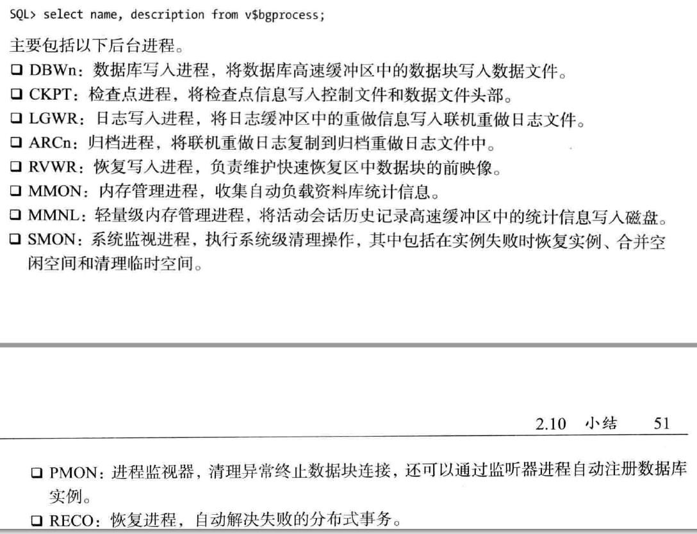
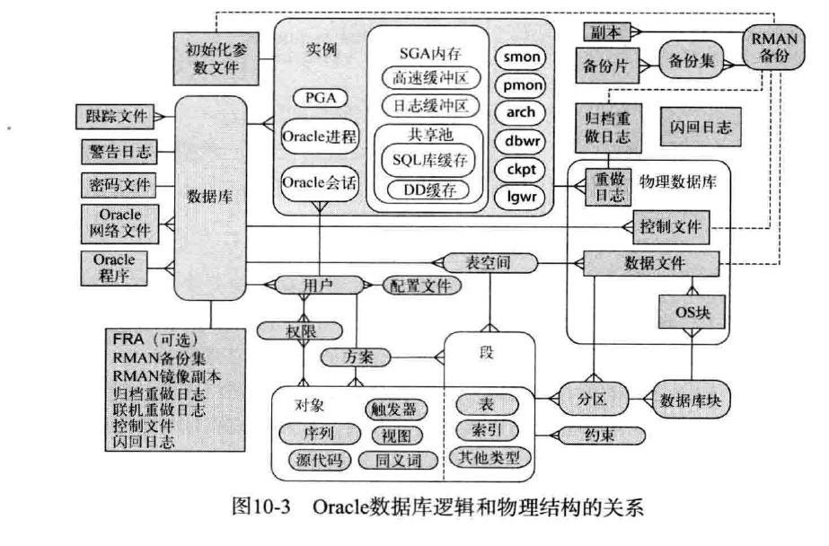
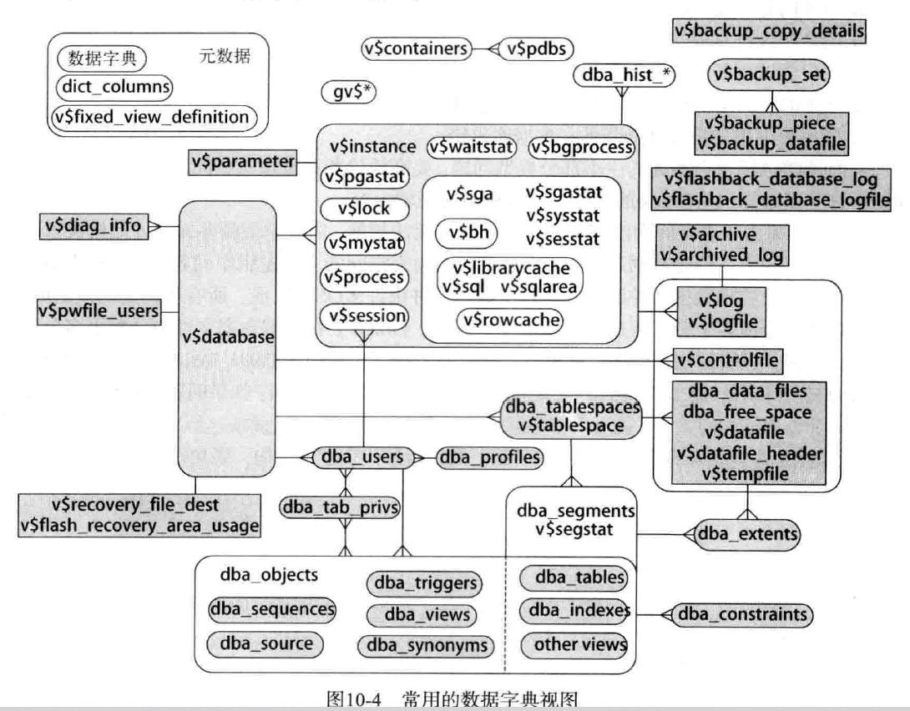

# oracle 数据库概念

## 数据库安装

## 数据库体系结构

### 后台进程

#### 查询后台进程

```
select name,description from v$bgprocess;
```

几个主要的后台进程




## 数据库概念

### 表

#### 表类型


#### 数据类型

| 类型   | 具体类型                                                     | 注意点                                                       |
| ------ | ------------------------------------------------------------ | ------------------------------------------------------------ |
| 字符型 | varchar2(n byte/n char)<br />char<br />nchar<br />nvarchar2  | 1.varchar2的两种定义形式（字节长度和字符长度）<br />2.varchar2最大长度（12c以前4000字符，12c及以后32767）,设置可扩展字符类型max_string_size=extended<br />3.char类型所分配的空间是固定的，即使没有占满<br />select dump(column) from table; |
| 数值型 | number(scale,precision)<br />binary_double<br />binary_float | 1.number(5,2)范围 -> +/-999.99<br />2.number最大长度38位     |
| 日期型 | date<br />timestamp(n)<br />interval                         | 1.date默认含时分秒<br /><br />2.timestamp精度0-9,默认6（附加类型：timestamp with time zone/timestamp with local time zone）<br />3.interval存储时间段(子类型interval year to month/interval day to second) |
| RAW    |                                                              | 1.raw类型存储二进制数据，长度（12c以前4000B，12c及以后32767B）<br />2.检索时默认会调用rawtohex函数，因此不能建普通索引，而要建基于函数的索引 |
| ROWID  |                                                              |                                                              |
| 大对象 | clob<br />nclob<br />blob<br />bfile                         | 1.clob->文本 <br />2.blob->图像、音视频<br />3.clob/nclob/blob属于内部大对象<br />4.bfile属于外部大对象，存储指向外部os中的文件的指针，但不参与事务，也不受安全性和备份和恢复的保护 |

#### 数据字典

##### 静态视图

查询用户、表、索引、约束、权限等。

/$ORACLE_HOME/rdbms/admin/sql.bsq -> 创建基础表USER$、TAB$、IND$等。

/$ORACLE_HOME/rdbms/admin/catalog.sql -> 创建静/动态视图

| 等级 | 常用视图 | 备注             |
| ---- | -------- | ---------------- |
| user |          | 当前用户         |
| all  |          | 可访问的         |
| dba  |          | 所有             |
| cdb  |          | 容器db（con_id） |

##### 动态视图

查询连接用户、在执行的sql、内存使用情况、锁、I/O等。

以X$表为基础表。

/$ORACLE_HOME/rdbms/admin/catalog.sql ->创建静/动态视图

v$  /  gv$

##### 逻辑物理结构和常用视图



